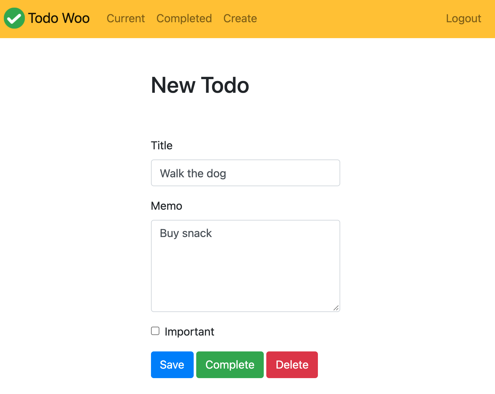
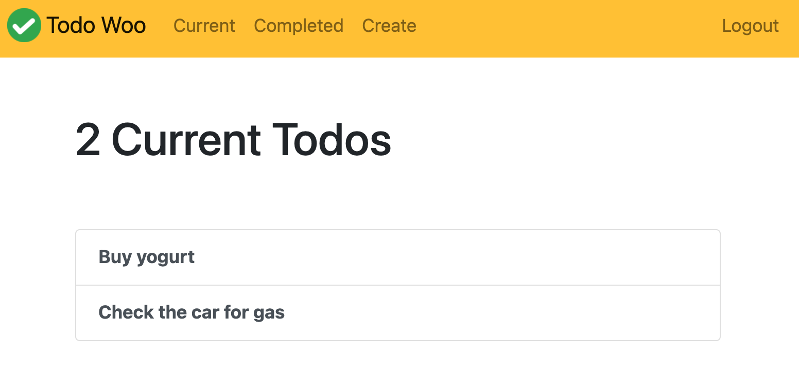

# TodoLoo

 

    

  

  This project was prepared to demonstrate the critical knowledge gap for a required class.
  

  

  Feel free to explore the [Wiki](https://github.com/active-sludge/TodoLoo/wiki) pages.
  

  
  

    

       
       
    

  

## Features

- [x] Create a task, Complete and track your tasks
- [x] Create an Account and carry your tasks with you anywhere
- [x] See a list of featured Articles from PubMed

## Requirements

- Python > 3.0
- pip > 3.0

## External Library

- asgiref 3.4.1
- Django 3.2.6
- pytz 2021.1
- sqlparse 0.4.1
- requests 2.26.0

## Usage

1. Clone from GitHub or Download .zip file. 
2. Open termiman and `cd` to project directory.
3. `pip install -r requirements.txt`
4. Wait for installation.
5. `python3 manage.py runserver`
6. Open `http://localhost:8000/` from the browser.

## Contact

iOS Developer - Can Dayan – hcdayan@hotmail.com – [@Linkedin](https://www.linkedin.com/in/can-d/) – [@Medium](https://activesludge.medium.com/) - [@Stackoverflow](https://stackoverflow.com/users/12594970/active-sludge)
